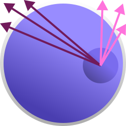
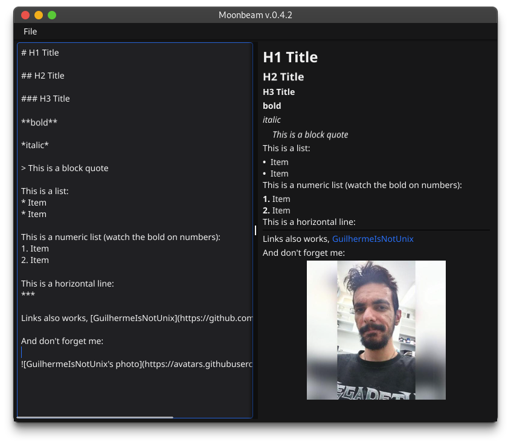

# Moonbeam

  

<em>Moonbeam, Guilherme Faura.</em>

 

## What is Moonbeam?

Moonbeam is a minimal Markdown text editor that aims to be distraction-free.  
Moonbeam was made in Go and has no external dependencies other than the Fyne GUI library.  

## License

Moonbeam is released under the Apache License, Version 2.0 (Apache-2.0). You can find a copy of the license in the LICENSE file in this repository or at [http://www.apache.org/licenses/LICENSE-2.0](http://www.apache.org/licenses/LICENSE-2.0).

This license allows you to use, modify, and distribute the software, subject to certain conditions. Please read the license carefully before using or contributing to this project.

### Logo Attribution
The Moonbeam logo was created by **Guilherme Faura (GuilhermeIsNotUnix)**. All rights to the logo are reserved by the creator.

We kindly ask all users and contributors to respect the terms of the license and the attribution of the logo. If you have any questions about usage or licensing, please open an issue in this repository or get in contact for clarification.

# Compiling from source

To compile basically you need to have all the imports, but Fyne have its requirements to work also, so you will need the **Go tools** (at least version > 1.16), a **C compiler** (GCC for example, to connect with system graphics drivers) and a **system graphics driver**, make sure you have them first on your system, then execute:

$ cd moonbeam  

$ go get fyne.io/fyne/v2@latest  

$ go install fyne.io/fyne/v2/cmd/fyne@latest  

$ go mod tidy

$ fyne package -name Moonbeam -appVersion 0.4.2 -os windows -icon moonbeam.png

(Or in case you need to change something, this is how you do it):

$ fyne package -name Name -appVersion {x.y.z} -os {windows or macos or linux} -icon Icon.png  

## Windows SmartScreen or Antivirus preventing use

Unfortunately, from the tests I did on Windows, some antiviruses remove the .exe or in other cases, when running for first time, Windows SmartScreen prevents its use with a security message. Note that there is nothing malicious about Moonbeam, the source is there and you can check it out or compile it yourself. The thing is, Microsoft wants money and Moonbeam is a program without a digital signature and it is not in the Microsoft store either and because of that antiviruses or Windows SmartScreen thinks it's malicious without actually checking that it is not something malicious. And the criticism I leave here is that it is too expensive in my country to pay a monthly digital subscription to maintain a non-profit program. So Windows SmartScreen labeling anything malware is ridiculous in my opinion, good job Microsoft, every day more reasons to make me prefer GNU/Linux...
